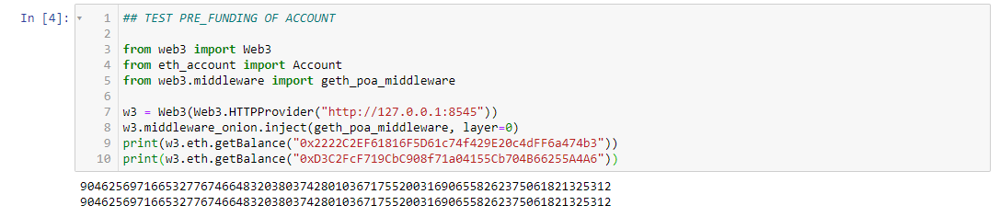

# Multi-Blockchain Wallet in Python
Submitted by Amar Munipalle
## Dependencies

Due to native difficulties on geth the final deployment could not be completed. The Jupyter notebook includes 'Proof of Work' for the enture body of work completed and attests to the validity of the code. The Ether balances have been printed and in addition a complete set of wallet keys generated.

Technical difficulties include:
* Lack of robust bitcoin faucets
* Inability to link HD-DERIVE keys and geth despite multiple attempts
* Inability of BTC Test faucets to fund HD-DERIVE based addresses

The code is robust and will function in a non test environment.

## GETH issues

Once the PoA network is up and running, it is impossible to reset the genesis block with bew keys generated by hd-derive. As the genesis block is incompatible

amuni@Amar-Desktop-XPS MINGW64 /c/Program Files/Blockchain Tools
$ ./geth --datadir node1 init rama.json
INFO [11-15|08:44:04.825] Maximum peer count                       ETH=50 LES=0 total=50
INFO [11-15|08:44:04.883] Allocated cache and file handles         database="C:\\Program Files\\Blockchain Tools\\node1\\geth\\chaindata" cache=16.00MiB handles=16
INFO [11-15|08:44:05.062] Persisted trie from memory database      nodes=355 size=50.81KiB time=14.974ms gcnodes=0 gcsize=0.00B gctime=0s livenodes=1 livesize=0.00B
### Fatal: Failed to write genesis block: database contains incompatible genesis (have 0426ad2d16295f1b9feb0763741af1f975e245a85e7e6c57ac52d2c0eb589af9, new 641a18290016cae87842123dae0f8bc9d2c01ce5fe3d246a55e0e76a4a4a247a)

